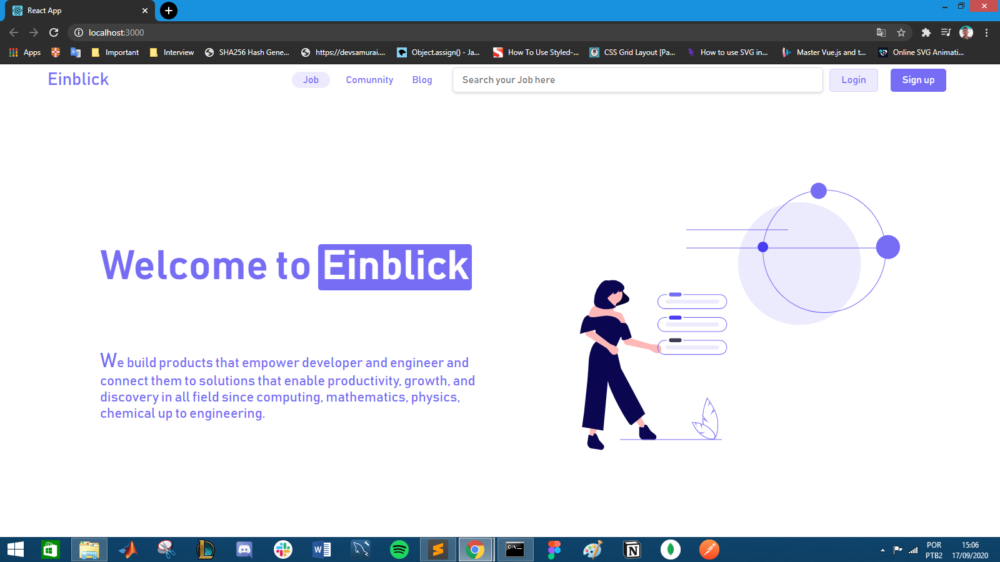

`Einblick` is a project created to make the experience of employers and employees easier, since the platform aims to unite employees with skills that correspond to those jobs, thus making it a perfect match.

The project is still in the development phase, every day that passes, I have new ideas that can add to those that are already implemented in the platform source code. Later, there will be integration with Linkedin API, increasing the user experience with the platform.

Made with <3 by Yuri Melo.